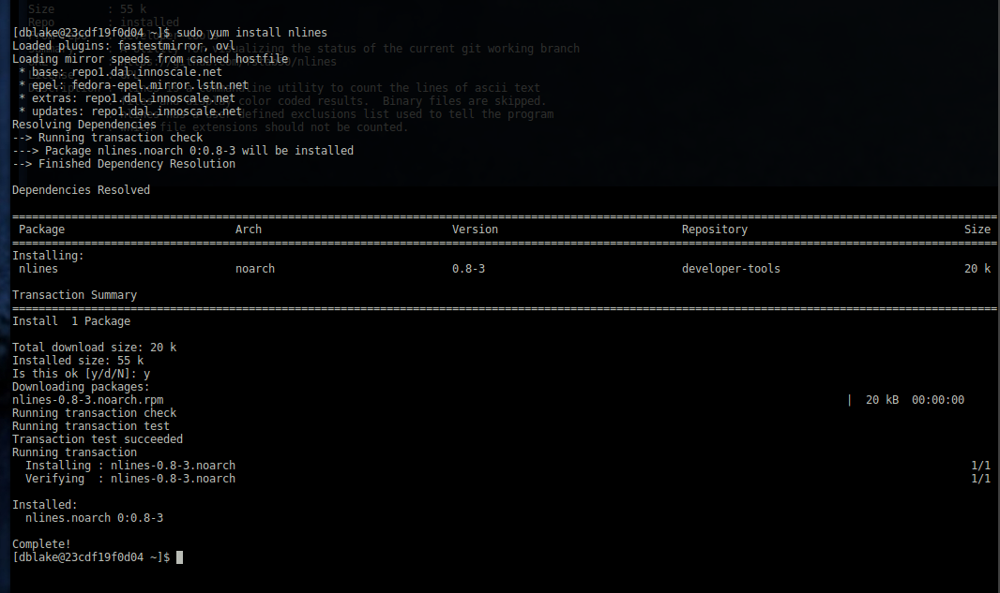
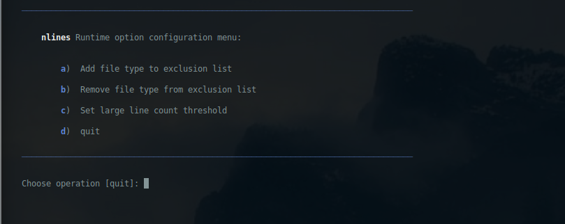
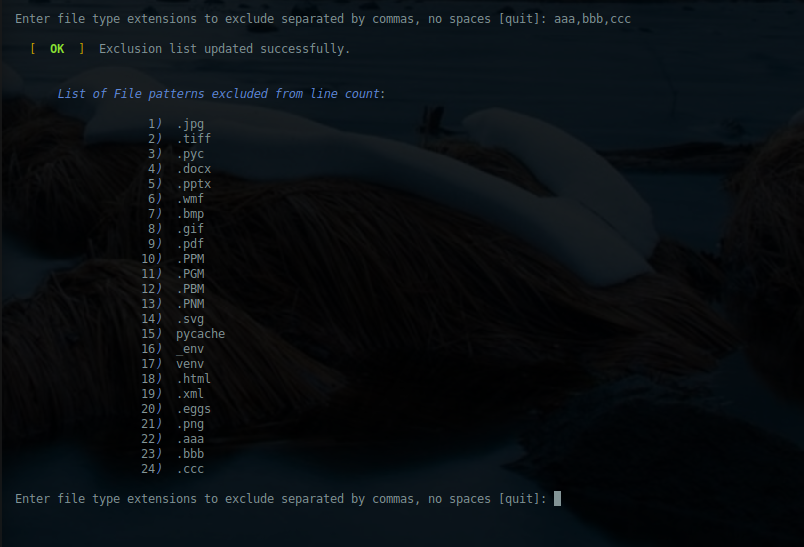
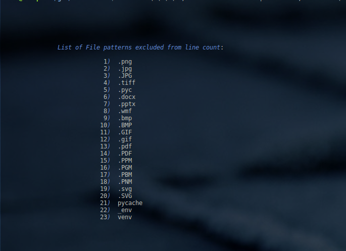

<a name="top"></a>
* * *
# nlines
* * *

## Summary

Count the number of lines of text in a code projects (or other text artifacts) in Linux operating system environments.  Ideal for Linux development environments which lack higher order language support such as [Python](http://www.python.org), [Nodejs](https://nodejs.org), etc.

**Version**:	1.1.1

* * *
## Contents

* [**Dependencies**](#dependencies)

* [**Supported Linux Distributions**](#supported-linux-distributions)

* [**Installation**](#installation)
    * [Ubuntu, Linux Mint, Debian-based Distributions](#installation)
    * [Redhat, CentOS, Fedora, Amazon Linux](#redhat-distro-install)

* [**Use**](#help)

* [**Exclusions**](#exclusions)

* [**Configuration**](#configuration)

* [**Screenshots**](#screenshots)

* [**Author & Copyright**](#author--copyright)

* [**License**](#license)

* [**Disclaimer**](#disclaimer)

--

[back to the top](#top)

* * *

## Dependencies

[nlines](https://github.com/fstab50/nlines) requires bash v4.4+

--

[back to the top](#top)

* * *
## Supported Linux Distributions

* Ubuntu 16.04, Ubuntu 18.04
* Linux Mint 18, 19
* Debian variants of Ubuntu / Linux Mint distributions above
* Redhat 7+, CentOS 7+


--

[back to the top](#top)

* * *
## Installation
* * *

### Ubuntu, Linux Mint, Debian variants

The easiest way to install **nlines** is via the Debian-tools repository:

1. Download the public key:

    ```
    $ wget -qO - http://awscloud.center/keys/public.key | sudo apt-key add -
    ```

2. Install the repository:

    ```
    $ sudo echo "deb [arch=amd64] http://deb.awscloud.center <distribution> main" > \
                 /etc/apt/sources.list.d/debian-tools.list
    ```

    **Where:** `<distribution>` is one of the following:

    - `trusty`:  Ubuntu 14.04, Ubuntu 14.04 based Linux distributions
    - `xenial`:  Ubuntu 16.04, 16.04 based Linux distributions
    - `bionic`:  Ubuntu 18.04, 18.04 based Linux distributions ([Linux Mint 19](https://www.linuxmint.com/download.php), etc)
    - `cosmic`:  Ubuntu 18.10, 18.10 based Linux distributions

3. Verify **debian-tools** repository installation

    ```
    $  grep ^ /etc/apt/sources.list /etc/apt/sources.list.d/*
    ```

    [](http://d1qxyi0fawulzu.cloudfront.net/nlines/repo-install-verify.png)

4. Update and install the package:

    ```
    $ sudo apt update  &&  sudo apt install nlines
    ```

5. Verify Installation.  To verify a Debian (.deb) package installation:

    ```
    $ apt show nlines
    ```

    [](http://d1qxyi0fawulzu.cloudfront.net/nlines/apt-show.png)

--

[back to the top](#top)


* * *
<a name="redhat-distro-install"></a>
### Redhat, CentOS, Fedora, Amazon Linux
The easiest way to install **nlines** on redhat-based Linux distributions is via the [developer-tools](http://awscloud.center) package repository:

1. Download and install the repo definition file

    ```
    $ sudo yum install wget
    ```

    ```
    $ wget http://awscloud.center/rpm/developer-tools.repo
    ```

    ```
    $ sudo mv developer-tools.repo /etc/yum.repos.d/  &&  sudo chown 0:0 developer-tools.repo
    ```

2. Update local repository cache

    ```
    $ sudo yum update -y
    ```

3. Install **nlines** os package

    ```
    $ sudo yum install -y nlines
    ```

    [](http://d1qxyi0fawulzu.cloudfront.net/nlines/rpm-install1.png)


4. Verify Installation

    ```
    $ yum info nlines
    ```

    [](http://d1qxyi0fawulzu.cloudfront.net/nlines/rpm-install2.png)

[back to the top](#top)


* * *
## Help

To display the help menu:

```bash
    $ nlines --help
```

[](http://d1qxyi0fawulzu.cloudfront.net/nlines/help-menu.png)


[back to the top](#top)

* * *
## Configuration

Run time options for [nlines](https://github.com/fstab50/nlines) can be configured by entering the configure menu:

```bash
    $ nlines --configure
```

[](http://d1qxyi0fawulzu.cloudfront.net/nlines/configure_1.png)

* **Option A**:  To add a new file type to exclude from line counting, select option "a":

[](http://d1qxyi0fawulzu.cloudfront.net/nlines/configure_2.png)

[](http://d1qxyi0fawulzu.cloudfront.net/nlines/configure_3.png)

* **Option B**: To remove a file type from the exclusion list so that files of this type are _included in line counts_, select option "B":

[](http://d1qxyi0fawulzu.cloudfront.net/nlines/configure_4.png)

* **Option C**: To change the threshold at which file objects are highlighted to indicate large line count, select option "c":

[](http://d1qxyi0fawulzu.cloudfront.net/nlines/configure_5.png)


[back to the top](#top)

* * *
## Exclusions

[nlines](https://github.com/fstab50/nlines) persists a list of excluded file types on the local filesystem.  To see this list, type the following:

```bash
    $ nlines --exclusions
```

[](http://d1qxyi0fawulzu.cloudfront.net/nlines/exclusions.png)<!-- .element height="50%" width="50%" -->


[back to the top](#top)

* * *
## Screenshots

Counting lines in large repository with long paths.

```bash
    $ nlines  --sum  git/AWSAMPLES/aws-serverless-workshops/
```

[](http://d1qxyi0fawulzu.cloudfront.net/nlines/repofinal.png)


[back to the top](#top)

* * *

## Author & Copyright

All works contained herein copyrighted via below author unless work is explicitly noted by an alternate author.

* Copyright Blake Huber, All Rights Reserved.

[back to the top](#top)

* * *

## License

* Software contained in this repo is licensed under the [license agreement](./LICENSE.md).

[back to the top](#top)

* * *

## Disclaimer

*Code is provided "as is". No liability is assumed by either the code's originating author nor this repo's owner for their use at AWS or any other facility. Furthermore, running function code at AWS may incur monetary charges; in some cases, charges may be substantial. Charges are the sole responsibility of the account holder executing code obtained from this library.*

Additional terms may be found in the complete [license agreement](./LICENSE.md).

[back to the top](#top)

* * *
